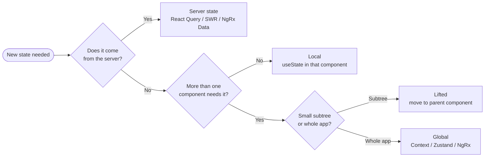

# State Management Gone Wrong

When the state map looks worse than the UI

---

# What is state?

<p class="card-subtitle">Any value your UI depends on that can change over time.</p>

<div class="card-grid-2">
  <div class="card">
    <div class="card-icon">
      <svg width="20" height="20" viewBox="0 0 24 24" fill="none" stroke="currentColor" stroke-width="2" stroke-linecap="round" stroke-linejoin="round">
        <ellipse cx="12" cy="5" rx="9" ry="3"/><path d="M3 5V19a9 3 0 0 0 18 0V5"/><path d="M3 12a9 3 0 0 0 18 0"/>
      </svg>
    </div>
    <div class="card-title">Server data</div>
    <div class="card-desc">The product list fetched from an API</div>
  </div>
  <div class="card">
    <div class="card-icon">
      <svg width="20" height="20" viewBox="0 0 24 24" fill="none" stroke="currentColor" stroke-width="2" stroke-linecap="round" stroke-linejoin="round">
        <line x1="4" x2="4" y1="21" y2="14"/><line x1="4" x2="4" y1="10" y2="3"/><line x1="12" x2="12" y1="21" y2="12"/><line x1="12" x2="12" y1="8" y2="3"/><line x1="20" x2="20" y1="21" y2="16"/><line x1="20" x2="20" y1="12" y2="3"/><line x1="2" x2="6" y1="14" y2="14"/><line x1="10" x2="14" y1="8" y2="8"/><line x1="18" x2="22" y1="16" y2="16"/>
      </svg>
    </div>
    <div class="card-title">UI state</div>
    <div class="card-desc">Which filters are selected? What panel is open?</div>
  </div>
  <div class="card">
    <div class="card-icon">
      <svg width="20" height="20" viewBox="0 0 24 24" fill="none" stroke="currentColor" stroke-width="2" stroke-linecap="round" stroke-linejoin="round">
        <path d="M11 4H4a2 2 0 0 0-2 2v14a2 2 0 0 0 2 2h14a2 2 0 0 0 2-2v-7"/><path d="M18.5 2.5a2.121 2.121 0 0 1 3 3L12 15l-4 1 1-4 9.5-9.5z"/>
      </svg>
    </div>
    <div class="card-title">Form state</div>
    <div class="card-desc">What has the user typed so far? Are there Validation errors?</div>
  </div>
  <div class="card">
    <div class="card-icon">
      <svg width="20" height="20" viewBox="0 0 24 24" fill="none" stroke="currentColor" stroke-width="2" stroke-linecap="round" stroke-linejoin="round">
        <polyline points="15 10 20 15 15 20"/><path d="M4 4v7a4 4 0 0 0 4 4h12"/>
      </svg>
    </div>
    <div class="card-title">Derived state</div>
    <div class="card-desc">The filtered product list or the total price — computed from other state</div>
  </div>
</div>

---

# Derived state

State that can be **computed from other state**

<v-clicks>

```ts
// State
const [items, setItems] = useState([...]);
const [filter, setFilter] = useState('active');

// Derived — just a variable, not useState
const visibleItems = items.filter(i => i.status === filter);
const totalCount = items.length;
const activeCount = items.filter(i => i.status === 'active').length;
```

</v-clicks>

---

# BUT: Derived state is a trap

Storing what you could compute creates a second source of truth.

- Two values drift apart the moment one updates
- You write an effect to keep them aligned
- The fix has its own bugs

<v-click>

**Derive on read.** A computed value, a selector, a `computed` signal — anything that runs when you ask for it.

</v-click>

---

# Server state isn't client state

<p class="card-subtitle">Data from an API has different needs than UI state.</p>

<div class="card-grid">
  <div class="card">
    <div class="card-icon">
      <svg width="20" height="20" viewBox="0 0 24 24" fill="none" stroke="currentColor" stroke-width="2" stroke-linecap="round" stroke-linejoin="round">
        <path d="M3 12a9 9 0 0 1 9-9 9.75 9.75 0 0 1 6.74 2.74L21 8"/><path d="M21 3v5h-5"/><path d="M21 12a9 9 0 0 1-9 9 9.75 9.75 0 0 1-6.74-2.74L3 16"/><path d="M8 16H3v5"/>
      </svg>
    </div>
    <div class="card-title">Lifecycle is complex</div>
    <div class="card-desc">Caching, refetching, invalidation, retries — all built-in concerns</div>
  </div>
  <div class="card">
    <div class="card-icon">
      <svg width="20" height="20" viewBox="0 0 24 24" fill="none" stroke="currentColor" stroke-width="2" stroke-linecap="round" stroke-linejoin="round">
        <circle cx="12" cy="12" r="10"/><polyline points="12 6 12 12 16 14"/>
      </svg>
    </div>
    <div class="card-title">Always potentially stale</div>
    <div class="card-desc">Stale-while-revalidate and optimistic updates are the norm, not the exception</div>
  </div>
  <div class="card">
    <div class="card-icon">
      <svg width="20" height="20" viewBox="0 0 24 24" fill="none" stroke="currentColor" stroke-width="2" stroke-linecap="round" stroke-linejoin="round">
        <circle cx="12" cy="12" r="10"/><line x1="12" x2="12" y1="8" y2="12"/><line x1="12" x2="12.01" y1="16" y2="16"/>
      </svg>
    </div>
    <div class="card-title">The server moves first</div>
    <div class="card-desc">It changes underneath you — your local copy is always a snapshot</div>
  </div>
</div>

> Use a server-state library and keep your client state for what's actually client state.


---

# Where should state live?

<div class="card-grid-2">
  <div class="card">
    <div class="card-icon">
      <svg width="20" height="20" viewBox="0 0 24 24" fill="none" stroke="currentColor" stroke-width="2" stroke-linecap="round" stroke-linejoin="round">
        <path d="M20 10c0 6-8 12-8 12s-8-6-8-12a8 8 0 0 1 16 0Z"/><circle cx="12" cy="10" r="3"/>
      </svg>
    </div>
    <div class="card-title">Local</div>
    <div class="card-desc">Only one component cares — keep it in <code>useState</code></div>
  </div>
  <div class="card">
    <div class="card-icon">
      <svg width="20" height="20" viewBox="0 0 24 24" fill="none" stroke="currentColor" stroke-width="2" stroke-linecap="round" stroke-linejoin="round">
        <path d="m5 12 7-7 7 7"/><path d="M12 19V5"/>
      </svg>
    </div>
    <div class="card-title">Lifted</div>
    <div class="card-desc">A small subtree shares it — move to the common parent</div>
  </div>
  <div class="card">
    <div class="card-icon">
      <svg width="20" height="20" viewBox="0 0 24 24" fill="none" stroke="currentColor" stroke-width="2" stroke-linecap="round" stroke-linejoin="round">
        <path d="M17.5 19H9a7 7 0 1 1 6.71-9h1.79a4.5 4.5 0 1 1 0 9Z"/>
      </svg>
    </div>
    <div class="card-title">Server state</div>
    <div class="card-desc">It lives on a server — treat it as such with React Query, SWR, or NgRx Data</div>
  </div>
  <div class="card">
    <div class="card-icon">
      <svg width="20" height="20" viewBox="0 0 24 24" fill="none" stroke="currentColor" stroke-width="2" stroke-linecap="round" stroke-linejoin="round">
        <circle cx="12" cy="12" r="10"/><path d="M12 2a14.5 14.5 0 0 0 0 20 14.5 14.5 0 0 0 0-20"/><path d="M2 12h20"/>
      </svg>
    </div>
    <div class="card-title">Global</div>
    <div class="card-desc">Genuinely cross-cutting — auth, theme, feature flags only</div>
  </div>
</div>

---

# Where should state live?



---

# Docs-as-Code: teach the AI your state conventions

<v-clicks>

```markdown
# docs/state-conventions.md

- Server data (API responses) → React Query / SWR
  Never duplicate into useState
- UI state → local unless two+ components need it
- Derive on read — no useEffect for sync
- Global state is the last resort, not the default
```

</v-clicks>

---
layout: statement
---

# But how do we handle Server State?

<v-click>

A request is never just "loading" or "done."

</v-click>
